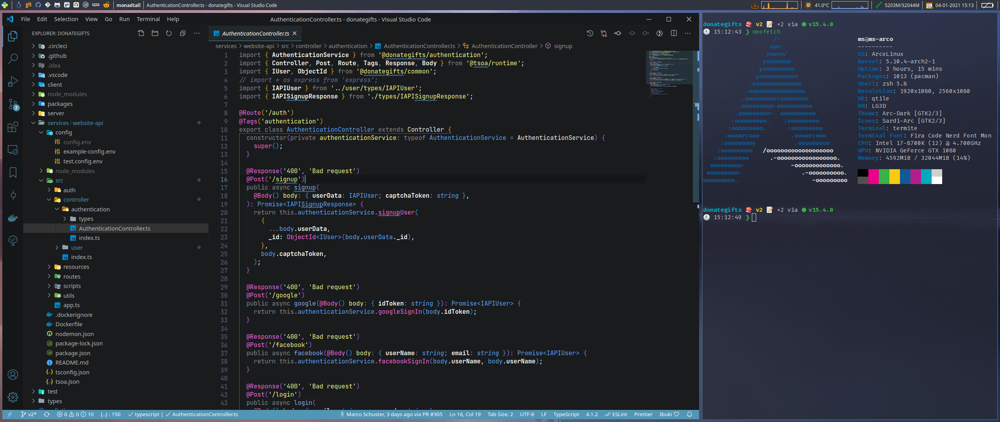

### required fonts
https://aur.archlinux.org/packages/ttf-ancient-fonts/

https://aur.archlinux.org/packages/nerd-fonts-fira-code/

https://archlinux.org/packages/extra/any/noto-fonts-emoji/

https://archlinux.org/packages/community/any/ttf-jetbrains-mono/

### required programs

https://starship.rs/

https://archlinux.org/packages/?name=rofi

https://archlinux.org/packages/community/x86_64/termite/

https://archlinux.org/packages/extra/x86_64/thunar/

https://archlinux.org/packages/extra/x86_64/xfce4-screenshooter/

https://archlinux.org/packages/extra/x86_64/htop/

https://archlinux.org/packages/community/x86_64/picom/
